# 0.0 全局架构总览（Top-Level Architecture）

> 本节展示 Claude Code 的整体分层架构。理解这张图是理解整个项目的关键——后续每一章都是在放大其中的某个子系统。

## 架构设计哲学

Claude Code 采用了经典的**分层架构**，从上到下大致分为：

1. **入口层 (Entry Layer)** — 程序的多种启动方式：CLI、MCP Server、Agent SDK
2. **引导层 (Bootstrap)** — 配置加载、状态初始化、路由分发
3. **核心引擎 (Core Engine)** — LLM 交互的核心循环：发请求、处理响应、执行工具、管理 Token
4. **注册表 (Registries)** — 工具、命令、Skill 的集中注册与发现
5. **工具层 (Tools)** — 42 个具体的工具实现
6. **命令层 (Commands)** — 101 个 Slash Command
7. **服务层 (Services)** — API 客户端、MCP、Compact、Analytics 等横切关注点
8. **多 Agent 系统** — Agent 生成、团队协作、信箱通信
9. **UI 层** — 基于 Ink 的自定义 React 终端渲染器
10. **状态层 (State)** — 中心化状态存储 + Observable 模式
11. **支撑层 (Support)** — 工具函数、类型定义、常量、Schema、迁移脚本
12. **特色子系统** — Vim 模式、IDE Bridge、语音输入、记忆系统等

> **关键洞察**：Claude Code 本质上是一个 **"LLM-in-the-loop" 的工具执行引擎**。用户输入 → 构建 Prompt → 调用 LLM → 解析响应 → 执行工具 → 将结果喂回 LLM → 循环直到完成。整个架构都围绕这个核心循环展开。

## 架构全景图

```mermaid
graph TB
    subgraph ENTRY["🚀 入口层 Entry Layer"]
        CLI["entrypoints/cli.tsx<br/>CLI 入口 · 参数解析 · --version fast-path"]
        INIT["entrypoints/init.ts<br/>配置加载 · 目录初始化 · 迁移"]
        MCP_ENTRY["entrypoints/mcp.ts<br/>MCP Server 入口"]
        SDK_ENTRY["entrypoints/sdk/<br/>Agent SDK 入口"]
    end

    subgraph BOOTSTRAP["⚙️ 引导层 Bootstrap"]
        MAIN["main.tsx (803KB)<br/>Commander.js 路由<br/>全局初始化编排"]
        BOOT_STATE["bootstrap/state.ts<br/>全局状态初始化<br/>Session 管理"]
        CONTEXT["context.ts<br/>系统 Prompt 构建<br/>环境信息收集"]
        HISTORY["history.ts<br/>会话历史管理<br/>Session 持久化"]
    end

    subgraph ENGINE["🧠 核心引擎 Core Engine"]
        QE["QueryEngine.ts (46KB)<br/>LLM 交互编排<br/>Tool 调用 · Token 追踪<br/>重试 · 错误处理"]
        QUERY["query.ts (68KB)<br/>流式 Tool 执行<br/>Auto-Compact<br/>消息过滤 · Hook 执行"]
        QUERY_CFG["query/config.ts<br/>Token 预算<br/>模型配置"]
    end

    subgraph REGISTRIES["📋 注册表 Registries"]
        TOOLS_REG["tools.ts<br/>42 个工具注册<br/>Feature-gated 条件加载"]
        CMD_REG["commands.ts<br/>101 个命令注册<br/>Slash Command 路由"]
        SKILLS_REG["skills/bundledSkills.ts<br/>17 个内建 Skill"]
    end

    subgraph TOOLS["🔧 工具层 Tools (42个)"]
        direction LR
        T_CORE["核心工具<br/>Bash · FileRead<br/>FileWrite · FileEdit<br/>Glob · Grep · Notebook"]
        T_WEB["网络工具<br/>WebFetch<br/>WebSearch"]
        T_AGENT["Agent 工具<br/>AgentTool · SendMessage<br/>TeamCreate · TeamDelete<br/>EnterWorktree · ExitWorktree"]
        T_TASK["Task 工具<br/>TaskCreate · TaskUpdate<br/>TaskGet · TaskList<br/>TaskStop · TaskOutput"]
        T_META["元工具<br/>SkillTool · ToolSearch<br/>EnterPlanMode · ExitPlanMode<br/>AskUserQuestion · Config"]
        T_MCP["MCP 工具<br/>MCPTool · LSPTool<br/>ListMcpResources<br/>ReadMcpResource"]
        T_GATED["实验性工具<br/>SleepTool · CronTools<br/>RemoteTrigger · Monitor<br/>PushNotification"]
    end

    subgraph COMMANDS["📟 命令层 Commands (101个)"]
        direction LR
        C_GIT["Git 命令<br/>commit · pr · review<br/>diff · branch · tag"]
        C_SESSION["Session 命令<br/>resume · clear · export<br/>share · rename · cost"]
        C_CONFIG["配置命令<br/>config · mcp · skills<br/>login · logout · theme"]
        C_DEV["开发命令<br/>doctor · compact<br/>context · memory<br/>vim · help · status"]
        C_GATED["实验性命令<br/>proactive · bridge<br/>voice · workflows<br/>brief · assistant"]
    end

    subgraph SERVICES["🔌 服务层 Services (36个)"]
        S_API["API 服务<br/>claude.ts · client.ts<br/>errors.ts · withRetry.ts<br/>logging.ts · usage.ts"]
        S_MCP["MCP 服务<br/>client.ts (119KB)<br/>config.ts · auth.ts<br/>MCPConnectionManager"]
        S_COMPACT["Compact 服务<br/>compact.ts · autoCompact<br/>microCompact<br/>sessionMemoryCompact"]
        S_ANALYTICS["Analytics 服务<br/>事件追踪 · Datadog<br/>GrowthBook Feature Gate"]
        S_TOOLS_SVC["Tool 服务<br/>StreamingToolExecutor<br/>toolOrchestration<br/>toolHooks"]
        S_OTHER["其他服务<br/>SessionMemory · OAuth<br/>LSP · Notifier<br/>Tips · Plugins"]
    end

    subgraph AGENT_SYSTEM["🤖 多 Agent 系统"]
        COORD["coordinator/<br/>coordinatorMode.ts<br/>多 Agent 编排"]
        SWARM["utils/swarm/<br/>teamHelpers · backends<br/>spawnInProcess<br/>inProcessRunner"]
        MAILBOX["utils/teammateMailbox.ts<br/>文件信箱系统<br/>Lockfile 同步"]
        TASKS["tasks/<br/>LocalAgent · RemoteAgent<br/>InProcessTeammate<br/>LocalShell · Dream"]
    end

    subgraph UI["🖥️ UI 层"]
        INK["ink/ (自定义 React 渲染器)<br/>reconciler · layout · events<br/>render-node-to-output<br/>terminal I/O"]
        COMPONENTS["components/ (144个)<br/>Dialogs · Messages<br/>Inputs · Selections<br/>Agent Status · Diffs"]
        SCREENS["screens/<br/>全屏布局"]
        HOOKS["hooks/ (85+个)<br/>useCanUseTool · useKeybindings<br/>useIDEIntegration<br/>useBackgroundTask"]
    end

    subgraph STATE["💾 状态层"]
        APP_STATE["state/AppState.tsx<br/>中心化状态定义<br/>用户 · 消息 · 任务 · Agent"]
        STATE_STORE["state/AppStateStore.ts<br/>Observable 状态存储<br/>持久化到 ~/.claude/"]
        CTX_PROVIDERS["context/ (8个 Provider)<br/>notifications · stats<br/>voice · modal · overlay<br/>mailbox · fpsMetrics"]
    end

    subgraph SUPPORT["📚 支撑层"]
        UTILS["utils/ (329+文件)<br/>auth · config · path<br/>Shell · tokens · messages<br/>permissions · attachments"]
        TYPES["types/ (8文件)<br/>Command · Hook · Permission<br/>Plugin · Message · IDs"]
        SCHEMAS["schemas/<br/>Zod Schema 校验"]
        CONSTANTS["constants/ (21文件)<br/>tools · keys · prompts<br/>betas · errorIds · oauth"]
        MIGRATIONS["migrations/ (11文件)<br/>版本迁移脚本"]
    end

    subgraph FEATURES["🌟 特色子系统"]
        VIM["vim/<br/>状态机 · operators<br/>motions · textObjects"]
        BRIDGE["bridge/ (33文件)<br/>IDE 双向通信<br/>JWT · Session · Trust"]
        VOICE["voice/<br/>语音输入模式"]
        BUDDY["buddy/<br/>陪伴精灵 UI"]
        MEMDIR["memdir/ (8文件)<br/>持久化记忆目录<br/>相关性检索"]
        REMOTE["remote/ (4文件)<br/>远程 Session 管理<br/>WebSocket 通信"]
        SERVER["server/ (3文件)<br/>Direct Connect<br/>WebSocket Server"]
    end

    %% 连线：入口层
    CLI -->|"lazy import"| MAIN
    CLI --> INIT
    MCP_ENTRY --> S_MCP
    SDK_ENTRY --> QE

    %% 连线：引导层 → 引擎
    MAIN --> BOOT_STATE
    MAIN --> CONTEXT
    MAIN --> HISTORY
    MAIN --> TOOLS_REG
    MAIN --> CMD_REG
    BOOT_STATE --> APP_STATE

    %% 连线：引擎
    MAIN -->|"用户输入"| QE
    QE -->|"执行查询"| QUERY
    QE --> TOOLS_REG
    QUERY --> QUERY_CFG
    QE --> S_API
    QUERY --> S_COMPACT

    %% 连线：引擎 → 工具/命令
    TOOLS_REG --> TOOLS
    CMD_REG --> COMMANDS
    QE -->|"调用工具"| T_CORE
    QE -->|"调用工具"| T_AGENT
    QE -->|"调用工具"| T_TASK

    %% 连线：Agent 系统
    T_AGENT -->|"生成 Agent"| TASKS
    T_AGENT -->|"团队管理"| SWARM
    T_AGENT -->|"消息传递"| MAILBOX
    COORD -->|"编排 Workers"| T_AGENT
    SWARM -->|"进程内/Pane"| TASKS
    TASKS --> APP_STATE

    %% 连线：服务层
    S_API -->|"Claude API"| QE
    S_MCP --> T_MCP
    S_COMPACT --> QUERY
    S_ANALYTICS --> MAIN
    S_TOOLS_SVC --> QUERY

    %% 连线：UI 层
    QE -->|"渲染结果"| INK
    INK --> COMPONENTS
    COMPONENTS --> HOOKS
    HOOKS --> APP_STATE
    HOOKS --> CTX_PROVIDERS

    %% 连线：状态
    APP_STATE --> STATE_STORE
    CTX_PROVIDERS --> APP_STATE

    %% 连线：支撑层（被广泛引用）
    UTILS -.->|"被所有层引用"| ENGINE
    TYPES -.-> TOOLS
    CONSTANTS -.-> ENGINE
    SCHEMAS -.-> TOOLS

    %% 连线：特色子系统
    BRIDGE --> SERVER
    BRIDGE --> QE
    MEMDIR --> QE
    REMOTE --> S_API

    %% 样式
    classDef entry fill:#e1f5fe,stroke:#0288d1
    classDef engine fill:#fff3e0,stroke:#f57c00
    classDef tools fill:#e8f5e9,stroke:#388e3c
    classDef services fill:#f3e5f5,stroke:#7b1fa2
    classDef agent fill:#fce4ec,stroke:#c62828
    classDef ui fill:#e0f2f1,stroke:#00695c
    classDef state fill:#fff9c4,stroke:#f9a825
    classDef support fill:#f5f5f5,stroke:#616161

    class CLI,INIT,MCP_ENTRY,SDK_ENTRY entry
    class MAIN,BOOT_STATE,CONTEXT,HISTORY entry
    class QE,QUERY,QUERY_CFG engine
    class TOOLS_REG,CMD_REG,SKILLS_REG engine
    class T_CORE,T_WEB,T_AGENT,T_TASK,T_META,T_MCP,T_GATED tools
    class C_GIT,C_SESSION,C_CONFIG,C_DEV,C_GATED tools
    class S_API,S_MCP,S_COMPACT,S_ANALYTICS,S_TOOLS_SVC,S_OTHER services
    class COORD,SWARM,MAILBOX,TASKS agent
    class INK,COMPONENTS,SCREENS,HOOKS ui
    class APP_STATE,STATE_STORE,CTX_PROVIDERS state
    class UTILS,TYPES,SCHEMAS,CONSTANTS,MIGRATIONS support
    class VIM,BRIDGE,VOICE,BUDDY,MEMDIR,REMOTE,SERVER support
```

## 各层职责速查

| 层 | 核心职责 | 关键文件 | 类比 |
|---|---------|---------|------|
| 入口层 | 接收不同来源的请求 | `cli.tsx`, `mcp.ts`, `sdk/` | Web 框架的路由入口 |
| 引导层 | 初始化一切 | `main.tsx` (803KB!) | Spring Boot 的 Application Context |
| 核心引擎 | LLM 交互循环 | `QueryEngine.ts`, `query.ts` | 事件循环 (Event Loop) |
| 注册表 | 能力发现 | `tools.ts`, `commands.ts` | 依赖注入容器 |
| 工具/命令层 | 具体能力实现 | 各工具目录 | 微服务中的各个服务 |
| 服务层 | 横切关注点 | `services/` | 中间件 (Middleware) |
| Agent 系统 | 多 Agent 协作 | `coordinator/`, `swarm/` | 分布式系统的节点编排 |
| UI 层 | 终端渲染 | `ink/`, `components/` | React DOM |
| 状态层 | 全局状态管理 | `AppState`, `AppStateStore` | Redux / MobX |

> **下一节**：[0.1 启动流程](./01-boot-sequence.md) — 让我们跟踪一次 `$ claude "fix this bug"` 的完整启动过程。
