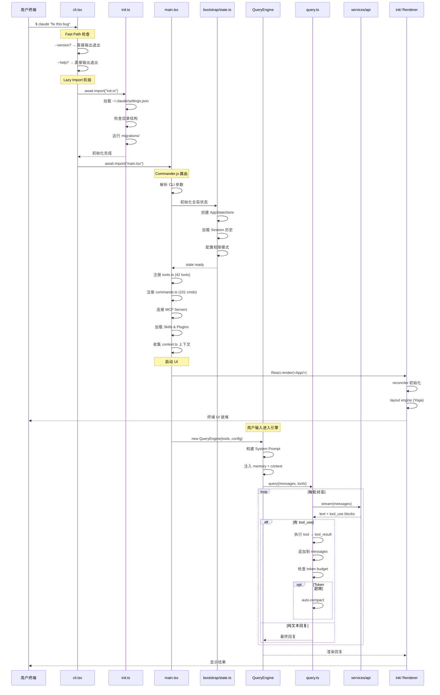

# 0.1 启动流程详图（Boot Sequence）

> 当你在终端输入 `$ claude "fix this bug"` 并按下回车，到 Claude Code 开始处理你的请求，中间究竟发生了什么？本节将完整追踪这个启动过程。

## 启动的三个阶段

Claude Code 的启动可以分为三个清晰的阶段：

### 阶段一：Fast Path 检查（毫秒级）

CLI 入口首先检查是否可以"速通"——`--version` 和 `--help` 不需要加载整个应用，直接输出后退出。这是一个常见的 CLI 优化技巧。

### 阶段二：初始化（数百毫秒）

通过 **lazy import** 加载 `init.ts` 和 `main.tsx`。之所以用 lazy import 而不是静态 import，是因为 `main.tsx` 高达 **803KB**——静态导入会显著拖慢 Fast Path。

初始化阶段按顺序完成：
1. 加载用户配置 (`~/.claude/settings.json`)
2. 检查目录结构是否完整
3. 运行必要的数据迁移脚本
4. 创建全局状态存储 (AppStateStore)
5. 注册所有 42 个工具和 101 个命令
6. 连接 MCP Servers
7. 收集环境上下文（OS、Shell、Git 信息等）

### 阶段三：Query 循环（持续运行）

引擎进入核心循环：构建 Prompt → 调用 API → 处理响应 → 执行工具 → 喂回结果。这个循环会一直运行到 LLM 返回纯文本回复（不再请求工具调用）为止。

## 启动流程时序图



## 关键设计决策解读

### 为什么用 Lazy Import？

```
CLI->>Init: await import("init.ts")
CLI->>Main: await import("main.tsx")
```

`main.tsx` 是 803KB 的超大文件，包含了整个应用的路由逻辑。如果用静态 `import`，即使用户只是运行 `claude --version`，也要等待整个模块加载。Lazy import 让 Fast Path 可以在毫秒级完成。

### 为什么有 Auto-Compact？

LLM 有 Token 上限。当对话过程中工具调用产生大量输出（比如读取大文件、执行长命令），消息列表会快速膨胀。`auto-compact` 机制在 Token 接近预算时自动压缩历史消息，保证对话可以持续进行。

### 为什么是 React 渲染终端？

Claude Code 使用了 **Ink**——一个用 React 渲染终端 UI 的框架（类似 React Native 之于移动端）。这让团队可以用声明式的组件模型来构建复杂的终端界面，而不是手动管理 ANSI 转义序列。

> **下一节**：[0.2 工具系统](./02-tool-architecture.md) — 深入了解 42 个工具是如何组织的。
