# 0.2 工具系统详图（Tool Architecture）

> 工具 (Tool) 是 Claude Code 的"手"——LLM 通过工具与外部世界交互。本节剖析 42 个工具的注册机制、内部结构和分类体系。

## 工具是什么？

在 Claude Code 的语境中，**工具就是 LLM 可以调用的函数**。当 Claude 判断需要读取文件、执行命令或搜索代码时，它会生成一个 `tool_use` 请求，Claude Code 捕获这个请求并执行对应的工具，然后将结果作为 `tool_result` 返回给 LLM。

每个工具由以下几部分组成：
- **Schema** — Zod 定义的输入参数格式（告诉 LLM 怎么调用）
- **Permissions** — 权限模型（是否需要用户审批）
- **Logic** — 核心执行逻辑
- **UI Component** — 终端渲染组件（展示工具调用结果）
- **Utils** — 辅助函数

## 工具注册的三种方式

| 方式 | 说明 | 示例 |
|------|------|------|
| **始终注册** | 核心工具，所有用户都可用 | Bash, FileRead, Grep |
| **Feature-Gated** | 需要特定 Feature Flag 才激活 | SleepTool, CronTools |
| **Lazy 注册** | 延迟加载，打破循环依赖 | AgentTool（因为 Agent 会递归创建 Agent） |

> **为什么需要 Lazy 注册？** AgentTool 可以生成子 Agent，子 Agent 又有自己的工具集（包括 AgentTool）。如果静态注册，会产生循环依赖。Lazy 注册通过延迟加载打破了这个循环。

## 工具分类全景

```mermaid
graph TB
    subgraph REGISTRY["tools.ts — 工具注册表"]
        direction LR
        REG_CORE["始终注册"]
        REG_GATED["Feature-Gated 注册"]
        REG_LAZY["Lazy 注册<br/>(打破循环依赖)"]
    end

    subgraph TOOL_ANATOMY["单个 Tool 的内部结构<br/>（以 BashTool 为例）"]
        direction TB
        SCHEMA["inputSchema.ts<br/>Zod Schema 定义<br/>command: string<br/>timeout?: number<br/>description?: string"]
        PERM["permissions.ts<br/>权限模型<br/>needsApproval(input)<br/>dangerousPatterns[]"]
        LOGIC["BashTool.ts<br/>核心逻辑<br/>call(input) → output<br/>validate() · execute()"]
        UI_COMP["components/<br/>BashToolUseMessage.tsx<br/>终端输出渲染"]
        UTIL["utils.ts<br/>命令解析 · 安全检查<br/>输出截断"]

        SCHEMA --> LOGIC
        PERM --> LOGIC
        LOGIC --> UI_COMP
        UTIL --> LOGIC
    end

    subgraph CORE_TOOLS["核心工具 (始终可用)"]
        BASH["🖥️ BashTool (18文件)<br/>Shell 命令执行<br/>安全校验 · 输出捕获"]
        FREAD["📖 FileReadTool (8文件)<br/>文件/图片/PDF/Notebook<br/>带缓存"]
        FWRITE["📝 FileWriteTool (8文件)<br/>文件创建/覆盖<br/>Diff 预览"]
        FEDIT["✏️ FileEditTool (10文件)<br/>局部字符串替换<br/>Diff 预览"]
        GLOB["🔍 GlobTool (6文件)<br/>递归文件匹配<br/>Git-aware 过滤"]
        GREP["🔎 GrepTool (7文件)<br/>ripgrep 搜索<br/>正则 + Glob 过滤"]
        NOTEBOOK["📓 NotebookEditTool (6文件)<br/>Jupyter Cell 编辑"]
        WFETCH["🌐 WebFetchTool (6文件)<br/>HTTP 请求<br/>HTML→Markdown"]
        WSEARCH["🔗 WebSearchTool (5文件)<br/>Web 搜索<br/>结果过滤"]
    end

    subgraph AGENT_TOOLS["Agent 工具"]
        AGENT_T["🤖 AgentTool (14文件)<br/>生成子 Agent<br/>同步/异步/进程内"]
        SEND_MSG["💬 SendMessageTool (5文件)<br/>Agent 间通信<br/>点对点 + 广播"]
        TEAM_C["👥 TeamCreateTool (4文件)<br/>创建 Agent 团队"]
        TEAM_D["🗑️ TeamDeleteTool (4文件)<br/>销毁团队 · 清理"]
        WORKTREE_E["🌿 EnterWorktreeTool (4文件)<br/>Git Worktree 隔离"]
        WORKTREE_X["🏠 ExitWorktreeTool (4文件)<br/>退出 Worktree<br/>Keep/Remove"]
    end

    subgraph TASK_TOOLS["Task 工具"]
        T_CREATE["TaskCreateTool"]
        T_UPDATE["TaskUpdateTool"]
        T_GET["TaskGetTool"]
        T_LIST["TaskListTool"]
        T_STOP["TaskStopTool"]
        T_OUTPUT["TaskOutputTool"]
    end

    subgraph META_TOOLS["元工具"]
        SKILL_T["SkillTool<br/>执行 Slash Commands"]
        TOOL_SEARCH["ToolSearchTool<br/>延迟工具发现"]
        PLAN_E["EnterPlanModeTool<br/>进入规划模式"]
        PLAN_X["ExitPlanModeTool<br/>退出规划模式"]
        ASK["AskUserQuestionTool<br/>向用户提问"]
        CONFIG_T["ConfigTool<br/>读写配置"]
        TODO["TodoWriteTool<br/>结构化任务列表"]
    end

    subgraph MCP_TOOLS["MCP 工具"]
        MCP_T["MCPTool<br/>MCP Server 调用"]
        LSP_T["LSPTool<br/>LSP 集成"]
        MCP_LIST["ListMcpResources<br/>MCP 资源枚举"]
        MCP_READ["ReadMcpResource<br/>MCP 资源读取"]
    end

    subgraph GATED_TOOLS["实验性工具 (Feature-Gated)"]
        SLEEP["SleepTool ⏸️<br/>PROACTIVE/KAIROS"]
        CRON_C["CronCreateTool ⏰<br/>AGENT_TRIGGERS"]
        CRON_D["CronDeleteTool<br/>AGENT_TRIGGERS"]
        CRON_L["CronListTool<br/>AGENT_TRIGGERS"]
        REMOTE_T["RemoteTriggerTool<br/>AGENT_TRIGGERS_REMOTE"]
        MONITOR["MonitorTool<br/>MONITOR_TOOL"]
        PUSH["PushNotificationTool<br/>KAIROS"]
        VERIFY["VerifyPlanExecution<br/>CLAUDE_CODE_VERIFY_PLAN"]
    end

    %% 注册关系
    REG_CORE --> CORE_TOOLS
    REG_CORE --> META_TOOLS
    REG_CORE --> TASK_TOOLS
    REG_CORE --> MCP_TOOLS
    REG_GATED --> GATED_TOOLS
    REG_LAZY -->|"打破循环依赖"| AGENT_TOOLS

    %% 工具 → 服务依赖
    BASH -->|"Shell 执行"| EXEC["utils/Shell.ts"]
    AGENT_T -->|"生成 Agent"| SWARM_SVC["utils/swarm/"]
    SEND_MSG -->|"文件信箱"| MBOX["utils/teammateMailbox.ts"]
    TEAM_C -->|"团队文件"| TEAM_H["utils/swarm/teamHelpers.ts"]
    MCP_T -->|"MCP 协议"| MCP_SVC["services/mcp/client.ts"]

    classDef core fill:#e8f5e9,stroke:#2e7d32
    classDef agent fill:#fce4ec,stroke:#c62828
    classDef task fill:#e3f2fd,stroke:#1565c0
    classDef meta fill:#fff3e0,stroke:#ef6c00
    classDef mcp fill:#f3e5f5,stroke:#6a1b9a
    classDef gated fill:#efebe9,stroke:#4e342e,stroke-dasharray: 5 5

    class BASH,FREAD,FWRITE,FEDIT,GLOB,GREP,NOTEBOOK,WFETCH,WSEARCH core
    class AGENT_T,SEND_MSG,TEAM_C,TEAM_D,WORKTREE_E,WORKTREE_X agent
    class T_CREATE,T_UPDATE,T_GET,T_LIST,T_STOP,T_OUTPUT task
    class SKILL_T,TOOL_SEARCH,PLAN_E,PLAN_X,ASK,CONFIG_T,TODO meta
    class MCP_T,LSP_T,MCP_LIST,MCP_READ mcp
    class SLEEP,CRON_C,CRON_D,CRON_L,REMOTE_T,MONITOR,PUSH,VERIFY gated
```

## 工具的安全模型

每个工具都有一个 `permissions.ts` 文件，定义了**该工具是否需要用户审批**。这是 Claude Code 安全设计的关键——LLM 不能在无人监督的情况下执行危险操作。

举例来说，BashTool 会检查命令中是否包含危险模式（如 `rm -rf /`、`curl | sh` 等），如果匹配则强制要求用户确认。而 FileReadTool 通常不需要审批，因为读取文件不会产生副作用。

权限模式分为三级：
1. **全部需审批** — 每次工具调用都需要用户确认
2. **智能审批** — 只有被标记为危险的调用需要确认（默认）
3. **全部自动** — 跳过所有确认（适合 CI/CD 场景）

> **下一节**：[0.3 多 Agent 系统](./03-agent-system.md) — 了解 Agent 如何生成子 Agent 并协作完成复杂任务。
