# 0.3 多 Agent 系统详图（Agent/Team Architecture）

> 这是 Claude Code 最令人兴奋的部分之一：一个 Agent 可以生成多个子 Agent，它们各自独立工作、互相通信，像一个小型团队一样协作完成复杂任务。

## 核心概念

### Agent 生成方式

Claude Code 支持三种 Agent 生成模式，适用于不同场景：

| 模式 | 特点 | 适用场景 |
|------|------|---------|
| **同步 Agent** | 父进程阻塞等待完成，结果直接返回 | 简单的子任务，如代码搜索 |
| **异步 Agent** | 后台 Task 运行，完成后通知父 Agent | 耗时任务，如运行测试套件 |
| **进程内 Agent** | 同进程并发（AsyncLocalStorage 隔离） | 高并发场景，避免进程开销 |

### 信箱系统（Mailbox）

Agent 间通过**基于文件的信箱系统**通信。每个 Agent 有自己的收件箱文件（`~/.claude/teams/{team}/inboxes/{agent}.json`），使用 `proper-lockfile` 保证并发写入的安全性。

消息类型包括：
- `plain_text` — 普通消息
- `shutdown_request` / `approved` / `rejected` — 优雅关机协议
- `plan_approval_request` / `response` — 计划审批
- `permission_request` / `response` — 权限请求
- `idle_notification` — 空闲通知

> **为什么用文件而不是 IPC？** 文件信箱的设计让 Agent 可以跨进程甚至跨机器通信，且状态天然持久化。即使某个 Agent 崩溃重启，未读消息不会丢失。

## 多 Agent 系统架构图

```mermaid
graph TB
    subgraph SPAWN["Agent 生成方式"]
        direction TB
        SYNC["同步 Agent<br/>父进程等待完成<br/>结果直接返回"]
        ASYNC["异步 Agent<br/>后台 Task 运行<br/>完成后通知"]
        INPROC["进程内 Agent<br/>AsyncLocalStorage 隔离<br/>同进程并发执行"]
    end

    subgraph AGENT_TOOL_FLOW["AgentTool 执行流程"]
        AT_CALL["AgentTool.call()"]
        RUN_AGENT["runAgent()<br/>异步生成器"]
        QUERY_LOOP["query() API 循环"]
        FINALIZE["finalizeAgentTool()<br/>收集 tokens/tools/duration"]
        NOTIFY["通知父 Agent<br/>task-notification XML"]

        AT_CALL --> RUN_AGENT
        RUN_AGENT --> QUERY_LOOP
        QUERY_LOOP -->|"yield messages"| RUN_AGENT
        RUN_AGENT --> FINALIZE
        FINALIZE --> NOTIFY
    end

    subgraph TEAM_SYSTEM["团队系统 (Swarm)"]
        TEAM_FILE["TeamFile<br/>~/.claude/teams/{name}/config.json"]
        LEADER["Team Lead<br/>team-lead@team-name"]
        MEMBER1["Teammate 1<br/>researcher@team-name"]
        MEMBER2["Teammate 2<br/>coder@team-name"]
        MEMBER3["Teammate 3<br/>reviewer@team-name"]

        LEADER -->|"管理"| MEMBER1
        LEADER -->|"管理"| MEMBER2
        LEADER -->|"管理"| MEMBER3
        TEAM_FILE -.->|"定义"| LEADER
        TEAM_FILE -.->|"定义"| MEMBER1
        TEAM_FILE -.->|"定义"| MEMBER2
        TEAM_FILE -.->|"定义"| MEMBER3
    end

    subgraph BACKENDS["Agent 后端"]
        direction LR
        BE_INPROC["InProcess Backend<br/>AsyncLocalStorage<br/>同进程执行<br/>backendType: 'in_process'"]
        BE_TMUX["Pane Backend (tmux)<br/>独立终端面板<br/>异步非阻塞<br/>backendType: 'tmux'"]
        BE_ITERM["Pane Backend (iTerm2)<br/>iTerm2 面板<br/>backendType: 'iterm'"]
    end

    subgraph MAILBOX["📬 信箱系统 (Mailbox)"]
        direction TB
        INBOX_PATH["~/.claude/teams/{team}/inboxes/{agent}.json"]
        LOCK["proper-lockfile<br/>并发写串行化"]
        MSG_TYPES["消息类型：<br/>• plain_text (普通消息)<br/>• shutdown_request/approved/rejected<br/>• plan_approval_request/response<br/>• permission_request/response<br/>• idle_notification"]

        INBOX_PATH --> LOCK
        LOCK --> MSG_TYPES
    end

    subgraph COMMUNICATION["Agent 间通信"]
        SM_TOOL["SendMessageTool"]
        P2P["点对点<br/>to: 'researcher'"]
        BROADCAST["广播<br/>to: '*'"]
        AUTO_RESUME["自动唤醒<br/>Agent 停止时<br/>自动 resume"]

        SM_TOOL --> P2P
        SM_TOOL --> BROADCAST
        SM_TOOL --> AUTO_RESUME
    end

    subgraph COORDINATOR["🎯 Coordinator 编排模式"]
        COORD_MODE["coordinatorMode.ts<br/>CLAUDE_CODE_COORDINATOR_MODE=1"]
        COORD_PROMPT["专用 System Prompt<br/>教 Coordinator 如何：<br/>• 生成 Workers (AgentTool)<br/>• 发送消息 (SendMessage)<br/>• 停止 Workers (TaskStop)<br/>• 先综合后分发"]
        WORKERS["Worker Agents<br/>独立执行子任务"]

        COORD_MODE --> COORD_PROMPT
        COORD_PROMPT -->|"编排"| WORKERS
    end

    subgraph TASK_TRACKING["📊 Task 状态追踪"]
        direction TB
        TASK_STATES["状态机：<br/>running → completed<br/>running → stopped<br/>running → failed<br/>running → paused"]

        LOCAL_AGENT["LocalAgentTaskState<br/>子进程 Agent"]
        REMOTE_AGENT["RemoteAgentTaskState<br/>远程 Agent"]
        INPROC_TASK["InProcessTeammateTaskState<br/>进程内 Teammate<br/>• abortController<br/>• isIdle 追踪<br/>• shutdownRequested<br/>• permissionMode<br/>• messages (cap 50)"]
        DREAM_TASK["DreamTaskState<br/>自动整合任务"]
    end

    subgraph WORKTREE["🌿 Worktree 隔离"]
        WT_ENTER["EnterWorktreeTool<br/>创建 git worktree<br/>切换 CWD"]
        WT_EXIT["ExitWorktreeTool<br/>Keep: 保留分支<br/>Remove: 清理 worktree"]
        WT_SAFETY["安全策略：<br/>• fail-closed (有变更时拒绝删除)<br/>• 需 discard_changes: true<br/>• 清理 tmux session"]

        WT_ENTER --> WT_EXIT
        WT_EXIT --> WT_SAFETY
    end

    subgraph LIFECYCLE["♻️ 生命周期管理"]
        IDLE["Idle Tracking<br/>isIdle 标志<br/>onIdleCallbacks"]
        SHUTDOWN["优雅关机<br/>shutdown_request →<br/>approved / rejected"]
        PERM_SYNC["权限同步<br/>syncTeammateMode()<br/>per-teammate 权限模式"]
        CLEANUP["清理<br/>TeamDeleteTool<br/>检查活跃成员<br/>清理 worktree/目录/tmux"]

        IDLE --> SHUTDOWN
        SHUTDOWN --> CLEANUP
        PERM_SYNC -.-> LEADER
    end

    %% 主要连接
    AT_CALL -->|"选择模式"| SPAWN
    SYNC --> QUERY_LOOP
    ASYNC --> QUERY_LOOP
    INPROC --> QUERY_LOOP

    LEADER -->|"SendMessage"| COMMUNICATION
    COMMUNICATION -->|"写入信箱"| MAILBOX
    MAILBOX -->|"Teammate 轮询"| MEMBER1
    MAILBOX -->|"Teammate 轮询"| MEMBER2

    TEAM_SYSTEM -->|"选择后端"| BACKENDS
    BE_INPROC -->|"创建"| INPROC_TASK
    BE_TMUX -->|"创建"| LOCAL_AGENT

    COORDINATOR -->|"使用"| AT_CALL
    COORDINATOR -->|"使用"| SM_TOOL

    MEMBER1 -->|"可获取"| WT_ENTER
    MEMBER2 -->|"可获取"| WT_ENTER

    INPROC_TASK --> LIFECYCLE

    classDef spawn fill:#e8eaf6,stroke:#283593
    classDef team fill:#fce4ec,stroke:#c62828
    classDef mail fill:#fff8e1,stroke:#f9a825
    classDef coord fill:#e0f7fa,stroke:#00695c
    classDef task fill:#f1f8e9,stroke:#33691e
    classDef wt fill:#efebe9,stroke:#4e342e

    class SYNC,ASYNC,INPROC spawn
    class LEADER,MEMBER1,MEMBER2,MEMBER3,TEAM_FILE team
    class INBOX_PATH,LOCK,MSG_TYPES mail
    class COORD_MODE,COORD_PROMPT,WORKERS coord
    class LOCAL_AGENT,REMOTE_AGENT,INPROC_TASK,DREAM_TASK task
    class WT_ENTER,WT_EXIT,WT_SAFETY wt
```

## Coordinator 模式：智能编排

Coordinator 模式是多 Agent 系统的"大脑"。启用后（`CLAUDE_CODE_COORDINATOR_MODE=1`），主 Agent 会被注入专用的 System Prompt，教它如何：

1. **分解任务** — 将复杂任务拆分为可独立执行的子任务
2. **生成 Workers** — 通过 AgentTool 创建专门的 Worker Agent
3. **分发工作** — 通过 SendMessage 给每个 Worker 分配任务
4. **监控进度** — 通过 TaskGet/TaskList 跟踪各 Worker 状态
5. **综合结果** — 收集所有 Worker 的产出，合并为最终结果

### Worktree 隔离：安全的并行开发

当多个 Agent 需要同时修改代码时，直接操作同一个工作目录会产生冲突。`EnterWorktreeTool` 利用 **Git Worktree** 为每个 Agent 创建独立的工作目录副本，实现真正的并行开发。

安全策略采用 **fail-closed** 设计：如果 Worktree 中有未提交的变更，`ExitWorktreeTool` 会拒绝删除，除非显式指定 `discard_changes: true`。

> **下一节**：[0.4 UI 渲染管线](./04-ui-rendering.md) — 探索 Claude Code 如何用 React 渲染终端界面。
