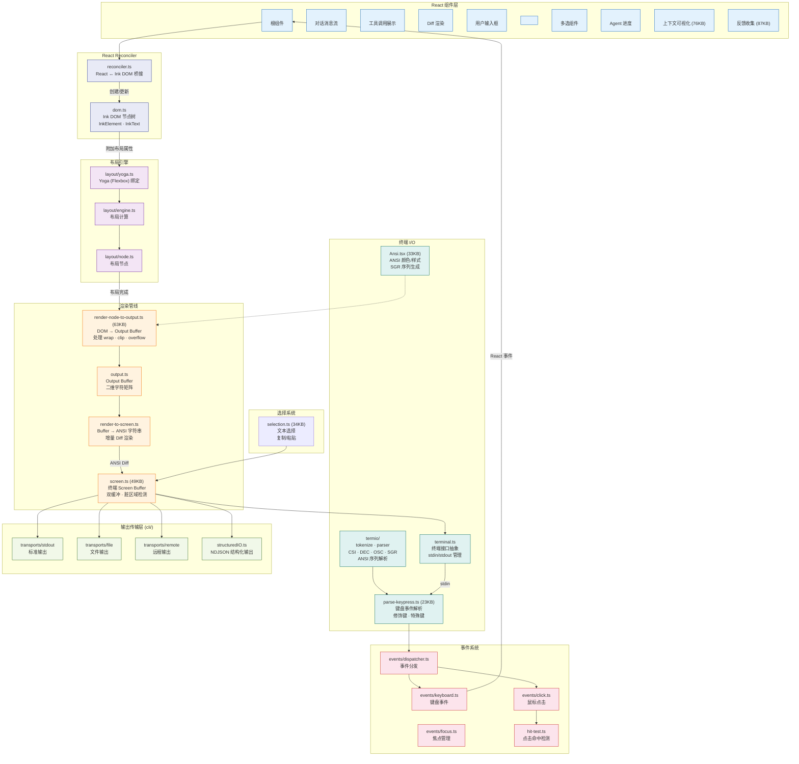

# 0.4 UI 渲染管线详图（Ink Rendering Pipeline）

> Claude Code 的终端界面不是简单的 `console.log`——它是一个完整的 React 应用，用自定义渲染器将 React 组件树渲染为 ANSI 终端输出。本节揭示这个令人惊叹的渲染管线。

## 为什么用 React 渲染终端？

传统的 CLI 工具通常直接用 `process.stdout.write` 输出文本。但 Claude Code 的 UI 远比普通 CLI 复杂：

- 流式输出的实时更新
- Diff 预览和语法高亮
- 多任务并行时的进度展示
- 弹窗、选择器、输入框
- Vim 模式的键盘交互

用命令式代码管理这些状态会极其复杂。React 的声明式模型让团队可以**描述 UI 应该是什么样**，而不是**如何更新 UI**。

## 渲染管线概览

渲染过程分为 5 个阶段：

```
React 组件 → Reconciler → DOM 树 → Yoga 布局 → Output Buffer → ANSI 输出
```

1. **React 组件** — 开发者用 JSX 编写 UI 组件（如 `<MessageList/>`、`<Dialog/>`）
2. **Reconciler** — 自定义的 React Reconciler 将组件树转换为 Ink DOM 节点
3. **Yoga 布局** — 使用 Facebook 的 Yoga 引擎计算 Flexbox 布局（和 React Native 同款）
4. **Output Buffer** — 将布局结果渲染为二维字符矩阵
5. **ANSI 输出** — 通过增量 Diff 渲染，只更新终端上变化的部分

## 渲染管线架构图



## 关键技术细节

### 双缓冲与增量渲染

`screen.ts` 实现了**双缓冲**机制：维护两个 Buffer（当前帧和上一帧），每次渲染时只计算差异部分，生成最少的 ANSI 转义序列发送到终端。这大幅减少了终端闪烁和 I/O 开销。

### 事件系统的双向流动

渲染管线是**单向**的（组件 → 终端），但事件系统是**反向**的（终端 → 组件）：

1. 终端接收到 stdin 数据
2. `parse-keypress.ts` 解析为结构化的键盘事件
3. 事件分发器将事件路由到正确的组件
4. React 组件处理事件，触发状态更新
5. 状态更新触发重新渲染（回到渲染管线）

### 多输出传输层

终端输出不一定只发往 `stdout`。Claude Code 支持多种输出传输：
- **stdout** — 标准终端输出
- **file** — 输出到文件（用于日志和调试）
- **remote** — 通过 WebSocket 发送到远程客户端
- **NDJSON** — 结构化 JSON 输出（用于程序集成）

> **下一节**：[0.5 服务层与扩展机制](./05-services-and-extensions.md) — 了解 API 调用、MCP、Skills 等服务如何运作。
