# 0.5 服务层与扩展机制详图（Services & Extensions）

> 服务层是 Claude Code 的"基础设施"——API 调用、MCP 协议、上下文压缩、分析追踪等横切关注点都在这里实现。扩展机制则让用户可以通过 Skills、Plugins 和 MCP Servers 定制 Claude Code 的能力。

## 六大核心服务

### 1. API 服务 — 与 Claude 对话的桥梁

API 服务封装了与 Claude API 的所有交互，包括：
- **Rate Limiting** — 遵守 API 速率限制
- **指数退避重试** — 临时错误自动重试，致命错误直接抛出
- **请求/响应日志** — 可选的调试日志
- **Token 用量追踪** — 精确记录每次调用的 Token 消耗

### 2. MCP 服务 — 连接外部世界

MCP (Model Context Protocol) 让 Claude Code 可以连接外部服务（数据库、API、文件系统等）。MCP 客户端实现高达 **119KB**，是整个项目中最大的单文件之一，足以说明 MCP 协议的复杂度。

### 3. Compact 服务 — 对抗 Token 膨胀

这可能是 Claude Code 最精妙的服务之一。随着对话进行，消息列表会不断增长，最终超过 LLM 的 Token 上限。Compact 服务通过三个层级的压缩策略来解决：
- **microCompact** — 单消息级别的压缩（如截断过长的工具输出）
- **autoCompact** — 当 Token 超过预算时自动触发的批量压缩
- **sessionMemoryCompact** — Session 级别的记忆压缩（跨对话保持上下文）

### 4. Analytics 服务 — 可观测性

事件追踪、性能监控（Datadog）、A/B 测试（GrowthBook Feature Gate）。

### 5. Tool 执行服务 — 工具调用的编排

`StreamingToolExecutor` 支持流式执行工具并实时展示进度，`toolOrchestration` 管理工具调用的生命周期和 Hook 执行。

### 6. 其他服务

SessionMemory（长期记忆）、OAuth（认证）、LSP（语言服务协议）、Notifier（桌面通知）等。

## 服务层架构图

```mermaid
graph TB
    subgraph API_SERVICE["API 服务 (services/api/)"]
        CLAUDE_CLIENT["claude.ts<br/>Claude API 客户端<br/>Rate Limiting"]
        HTTP_CLIENT["client.ts<br/>底层 HTTP 客户端"]
        RETRY["withRetry.ts<br/>指数退避重试"]
        API_ERR["errors.ts<br/>错误分类<br/>可重试 vs 致命"]
        API_LOG["logging.ts<br/>请求/响应日志"]
        USAGE["usage.ts<br/>Token 用量追踪"]
        API_BOOT["bootstrap.ts<br/>启动数据获取"]

        HTTP_CLIENT --> CLAUDE_CLIENT
        RETRY --> CLAUDE_CLIENT
        API_ERR --> RETRY
        API_LOG --> CLAUDE_CLIENT
        USAGE --> CLAUDE_CLIENT
    end

    subgraph MCP_SERVICE["MCP 服务 (services/mcp/)"]
        MCP_CLIENT["client.ts (119KB)<br/>MCP 客户端实现"]
        MCP_CONFIG["config.ts (51KB)<br/>Server 配置管理"]
        MCP_AUTH["auth.ts (88KB)<br/>OAuth · API Key<br/>认证流程"]
        MCP_CONN["MCPConnectionManager.tsx<br/>连接生命周期管理"]
        MCP_XAA["xaa.ts<br/>外部认证集成"]
        MCP_CHAN["channelPermissions.ts<br/>Channel 权限管理"]

        MCP_CONFIG --> MCP_CLIENT
        MCP_AUTH --> MCP_CLIENT
        MCP_CLIENT --> MCP_CONN
    end

    subgraph COMPACT_SERVICE["Compact 服务 (services/compact/)"]
        COMPACT["compact.ts (60KB)<br/>核心压缩算法"]
        AUTO_COMPACT["autoCompact.ts<br/>自动触发压缩<br/>Token 阈值监控"]
        MICRO_COMPACT["microCompact.ts<br/>微压缩<br/>单消息级别"]
        SESSION_COMPACT["sessionMemoryCompact.ts<br/>Session 记忆压缩"]
        COMPACT_PROMPT["prompt.ts<br/>压缩 Prompt 模板"]
        GROUPING["grouping.ts<br/>消息分组策略"]

        AUTO_COMPACT --> COMPACT
        MICRO_COMPACT --> COMPACT
        SESSION_COMPACT --> COMPACT
        COMPACT_PROMPT --> COMPACT
        GROUPING --> COMPACT
    end

    subgraph ANALYTICS_SERVICE["Analytics 服务"]
        EVENT_LOG["firstPartyEventLogger<br/>第一方事件追踪"]
        DATADOG["datadog<br/>性能监控"]
        GROWTHBOOK["GrowthBook<br/>Feature Gate<br/>A/B 测试"]
    end

    subgraph TOOL_SERVICE["Tool 执行服务 (services/tools/)"]
        STREAM_EXEC["StreamingToolExecutor.ts<br/>流式工具执行<br/>进度展示"]
        ORCH["toolOrchestration.ts<br/>工具调用编排"]
        EXEC["toolExecution.ts<br/>执行上下文"]
        TOOL_HOOKS["toolHooks.ts<br/>工具生命周期 Hook"]

        ORCH --> STREAM_EXEC
        EXEC --> STREAM_EXEC
        TOOL_HOOKS --> ORCH
    end

    subgraph OTHER_SERVICES["其他服务"]
        SESSION_MEM["SessionMemory/ (6文件)<br/>长期记忆管理"]
        EXTRACT_MEM["extractMemories/ (3文件)<br/>对话中提取记忆"]
        OAUTH_SVC["oauth/ (3文件)<br/>OAuth 流程处理"]
        LSP_SVC["lsp/ (4文件)<br/>LSP 客户端"]
        NOTIFIER["notifier.ts<br/>桌面/终端通知"]
        RATE_MSG["rateLimitMessages.ts<br/>限流消息"]
        TOKEN_EST["tokenEstimation.ts<br/>Token 计数估算"]
        TIPS["tips/ (3文件)<br/>上下文提示建议"]
        PLUGIN_SVC["plugins/ (7文件)<br/>插件管理"]
    end

    subgraph EXTENSIONS["扩展机制"]
        direction TB

        subgraph SKILLS_SYS["Skills 系统 (skills/)"]
            SKILL_LOAD["loadSkillsDir.ts (34KB)<br/>从 ~/.claude/skills/ 加载"]
            SKILL_BUNDLED["bundledSkills.ts<br/>17 个内建 Skill"]
            SKILL_MCP["mcpSkillBuilders.ts<br/>从 MCP 构建 Skill"]

            SKILL_LIST["内建 Skills：<br/>• commit · review · pr<br/>• claude-api · debug<br/>• keybindings · loop<br/>• remember · simplify<br/>• schedule · verify<br/>• stuck · updateConfig"]
        end

        subgraph PLUGIN_SYS["Plugin 系统 (plugins/)"]
            PLUGIN_BUILTIN["builtinPlugins.ts<br/>内建插件注册表"]
            PLUGIN_LOAD["pluginLoader (utils/)<br/>插件发现与加载"]
            PLUGIN_HOOK["Plugin Lifecycle<br/>onLoad · onUnload<br/>onToolUse · onMessage"]
        end

        subgraph MCP_EXT["MCP 扩展"]
            MCP_SERVERS["外部 MCP Servers<br/>用户配置<br/>~/.claude/mcp.json"]
            MCP_OFFICIAL["officialRegistry.ts<br/>官方 MCP Registry"]
            MCP_TOOLS_EXT["MCP → Tools<br/>动态注册工具"]
        end
    end

    subgraph HOOKS_SYS["Hooks 系统 (hooks/)"]
        H_PERM["useCanUseTool (40KB)<br/>权限检查 Hook"]
        H_KEY["useGlobalKeybindings<br/>全局快捷键"]
        H_IDE["useIDEIntegration<br/>IDE 通信"]
        H_BG["useBackgroundTaskNavigation<br/>后台任务切换"]
        H_INBOX["useInboxPoller (34KB)<br/>信箱轮询"]
        H_SUGGEST["fileSuggestions<br/>文件自动补全"]
        H_MEM["useMemoryUsage<br/>内存监控"]
    end

    %% 服务被引擎使用
    QE_REF["QueryEngine"]
    QUERY_REF["query.ts"]

    QE_REF --> CLAUDE_CLIENT
    QE_REF --> STREAM_EXEC
    QUERY_REF --> AUTO_COMPACT
    QUERY_REF --> MCP_CLIENT

    %% 扩展 → 工具注册
    SKILL_LOAD -->|"注册为 Tool"| TOOLS_REF["tools.ts"]
    MCP_TOOLS_EXT -->|"动态注册"| TOOLS_REF
    PLUGIN_SVC -->|"Hook 注入"| TOOL_HOOKS

    %% Analytics 被广泛使用
    GROWTHBOOK -.->|"Feature Gate"| TOOLS_REF
    EVENT_LOG -.->|"事件追踪"| QE_REF

    classDef api fill:#e3f2fd,stroke:#1565c0
    classDef mcp fill:#f3e5f5,stroke:#6a1b9a
    classDef compact fill:#fff3e0,stroke:#ef6c00
    classDef analytics fill:#e8f5e9,stroke:#2e7d32
    classDef ext fill:#fce4ec,stroke:#c62828
    classDef hook fill:#e0f2f1,stroke:#00695c

    class CLAUDE_CLIENT,HTTP_CLIENT,RETRY,API_ERR,API_LOG,USAGE,API_BOOT api
    class MCP_CLIENT,MCP_CONFIG,MCP_AUTH,MCP_CONN,MCP_XAA,MCP_CHAN mcp
    class COMPACT,AUTO_COMPACT,MICRO_COMPACT,SESSION_COMPACT,COMPACT_PROMPT,GROUPING compact
    class EVENT_LOG,DATADOG,GROWTHBOOK analytics
    class SKILL_LOAD,SKILL_BUNDLED,SKILL_MCP,SKILL_LIST,PLUGIN_BUILTIN,PLUGIN_LOAD,PLUGIN_HOOK,MCP_SERVERS,MCP_OFFICIAL,MCP_TOOLS_EXT ext
    class H_PERM,H_KEY,H_IDE,H_BG,H_INBOX,H_SUGGEST,H_MEM hook
```

## 三大扩展机制对比

| 机制 | 粒度 | 来源 | 用途 |
|------|------|------|------|
| **Skills** | 高层抽象（一个 Skill = 一个完整的工作流） | 内建 17 个 + 用户自定义 (`~/.claude/skills/`) | `/commit`、`/review`、`/pr` 等 Slash Command |
| **Plugins** | 中层 Hook（拦截工具调用和消息） | 内建 + 用户自定义 | 自定义权限检查、消息过滤等 |
| **MCP Servers** | 底层工具（每个 Server 暴露一组工具） | 用户配置 (`~/.claude/mcp.json`) | 连接数据库、API、第三方服务 |

> **关键洞察**：这三种机制形成了一个**扩展金字塔**。MCP 在最底层提供原子能力，Plugin 在中间层提供行为定制，Skill 在最上层提供端到端的工作流。用户可以根据需求在不同层级进行扩展。

> **下一节**：[0.6 数据流全景](./06-data-flow.md) — 从输入到输出，完整追踪一次用户交互的数据流转。
