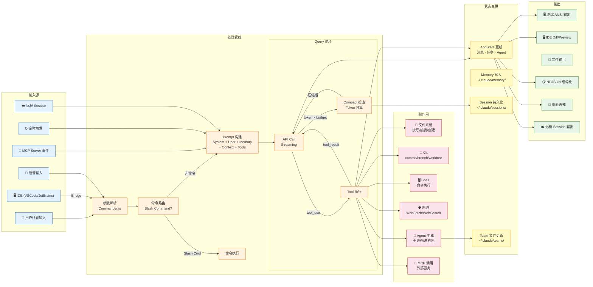

# 0.6 数据流全景图（End-to-End Data Flow）

> 前面几节分别介绍了各个子系统的内部结构。本节将视角拉高，追踪一次完整的用户交互：**数据从哪里来、经过了什么处理、产生了什么副作用、最终输出到哪里**。

## 数据流的四个阶段

一次完整的交互可以分为四个阶段：

### 1. 输入（Input）

Claude Code 支持 **6 种输入源**，不仅仅是终端键盘输入：

| 输入源 | 说明 |
|--------|------|
| 用户终端 | 最常见的交互方式，在终端中输入文本 |
| IDE | 通过 Bridge 从 VSCode/JetBrains 接收指令 |
| 语音输入 | 通过麦克风输入（实验性功能） |
| MCP Server | 外部服务推送的事件 |
| 定时触发 | Cron 定时任务自动触发 |
| 远程 Session | 通过 WebSocket 从远程客户端接收 |

### 2. 处理（Processing）

所有输入最终都进入 **Query 循环**——这是整个系统的核心。处理管线的关键步骤：

1. **参数解析** — Commander.js 解析 CLI 参数
2. **命令路由** — 判断是 Slash Command 还是普通对话
3. **Prompt 构建** — 组装 System Prompt + User Message + Memory + Context + Tools 定义
4. **API 调用** — 流式发送到 Claude API
5. **工具执行** — 解析 `tool_use` 并执行
6. **Compact 检查** — Token 超限时压缩

### 3. 副作用（Side Effects）

工具执行会产生各种副作用——这是 Claude Code 真正"做事"的部分：

- 文件系统操作（读写、编辑、创建）
- Git 操作（commit、branch、worktree）
- Shell 命令执行
- 网络请求（WebFetch、WebSearch）
- Agent 生成（创建子 Agent）
- MCP 调用（与外部服务交互）

### 4. 输出（Output）

处理结果通过多种渠道输出：

| 输出渠道 | 说明 |
|---------|------|
| 终端 ANSI | 格式化的终端输出（默认） |
| IDE Diff/Preview | 在 IDE 中显示文件变更 |
| 文件输出 | 日志和调试信息 |
| NDJSON | 结构化 JSON 输出（用于程序集成） |
| 桌面通知 | 长任务完成时的系统通知 |
| 远程 Session | 通过 WebSocket 发送到远程客户端 |

## 数据流全景架构图



## 一个具体例子：`$ claude "fix the bug in auth.ts"`

让我们用一个具体例子串联整个数据流：

```
1. [输入]     用户在终端输入 "fix the bug in auth.ts"
2. [解析]     Commander.js 解析为普通对话（不是 Slash Command）
3. [构建]     组装 Prompt：System Prompt + "fix the bug in auth.ts" + 环境上下文
4. [API]      流式发送到 Claude API
5. [响应]     Claude 返回 tool_use: FileRead("auth.ts")
6. [执行]     FileReadTool 读取 auth.ts 内容
7. [喂回]     将文件内容作为 tool_result 追加到消息列表
8. [API]      再次调用 Claude API（带上文件内容）
9. [响应]     Claude 返回 tool_use: FileEdit("auth.ts", old_str, new_str)
10. [权限]    FileEditTool 检查权限 → 需要用户确认
11. [UI]      终端显示 Diff 预览，等待用户按 y/n
12. [执行]    用户确认后执行编辑
13. [喂回]    编辑结果作为 tool_result 追加
14. [API]     再次调用 Claude API
15. [响应]    Claude 返回纯文本："我已经修复了 auth.ts 中的 bug..."
16. [输出]    终端渲染最终回复
17. [状态]    Session 持久化到 ~/.claude/sessions/
```

> **关键观察**：整个过程是一个 **循环**，不是线性的。步骤 4-7（或 4-13）会反复执行，直到 Claude 返回纯文本回复。这就是为什么它叫 "Query 循环"。

---

> 恭喜你完成了 Chapter 0 的阅读！现在你应该对 Claude Code 的整体架构有了全面的了解。后续章节将深入每个子系统的具体实现。
>
> 返回 [Chapter 0 目录](./README.md)
