# 0.2 工具系统详图（Tool Architecture）

> 工具 (Tool) 是 Claude Code 的"手"——LLM 通过工具与外部世界交互。本节剖析 42 个工具的注册机制、内部结构和分类体系。

## 工具是什么？

在 Claude Code 的语境中，**工具就是 LLM 可以调用的函数**。当 Claude 判断需要读取文件、执行命令或搜索代码时，它会生成一个 `tool_use` 请求，Claude Code 捕获这个请求并执行对应的工具，然后将结果作为 `tool_result` 返回给 LLM。

每个工具由以下几部分组成：
- **Schema** — Zod 定义的输入参数格式（告诉 LLM 怎么调用）
- **Permissions** — 权限模型（是否需要用户审批）
- **Logic** — 核心执行逻辑
- **UI Component** — 终端渲染组件（展示工具调用结果）
- **Utils** — 辅助函数

## 工具注册的三种方式

| 方式 | 说明 | 示例 |
|------|------|------|
| **始终注册** | 核心工具，所有用户都可用 | Bash, FileRead, Grep |
| **Feature-Gated** | 需要特定 Feature Flag 才激活 | SleepTool, CronTools |
| **Lazy 注册** | 延迟加载，打破循环依赖 | AgentTool（因为 Agent 会递归创建 Agent） |

> **为什么需要 Lazy 注册？** 这是整个工具系统中最精妙的工程细节之一。下面从零开始讲清楚。

---

### 先理解"循环依赖"是什么问题

用一个生活比喻：

> 想象你在组装一本《员工手册》。手册里有一章叫"如何招聘新员工"。但"如何招聘新员工"这一章里写着："给新员工一本《员工手册》"。
>
> 问题来了：你还没写完手册，就要把它交给新员工——但手册里"招聘"那章又需要引用完整的手册。**手册引用了招聘章节，招聘章节又引用了手册本身**。

在代码里，这就叫**循环依赖**（Circular Dependency）。

### 在 Claude Code 里，循环具体发生在哪？

Claude Code 有一个"工具注册表"文件 `tools.ts`，它就像那本《员工手册》——记录了所有 42 个工具。其中有一个工具叫 `TeamCreateTool`（创建 Agent 团队），它就像那个"招聘"章节。

问题链：

```
第 1 步：tools.ts 说："我要把 TeamCreateTool 登记进来"
           → 于是去加载 TeamCreateTool 的代码

第 2 步：TeamCreateTool 说："我要创建团队，需要知道团队成员能用哪些工具"
           → 于是去加载 swarm/teamHelpers.ts

第 3 步：teamHelpers.ts 说："我要组装工具列表，需要用 tools.ts 里的 assembleToolPool 函数"
           → 于是去加载 tools.ts

💥 问题！tools.ts 正在第 1 步加载中，还没加载完！
   teamHelpers 拿到的是一个"半成品"的 tools.ts，
   assembleToolPool 函数可能是 undefined！
```

画成图：

```
tools.ts ──加载──→ TeamCreateTool.ts
                        │
                        └──加载──→ teamHelpers.ts
                                       │
                                       └──加载──→ tools.ts  ← 💥 它还在加载第一步呢！
```

这就像你翻开手册第 5 章"招聘"，第 5 章说"请参阅完整手册"，但你手里这本手册还只印到第 4 章——第 5 章就是你正在读的这一页。**死循环**。

### 解法一：Lazy Getter — "先留个电话，需要时再联系"

Claude Code 的解法很聪明：**不在一开始就加载 TeamCreateTool，而是留一个"电话号码"**（一个函数），等真正需要时再打电话去取。

```tsx
// 📜 src/tools.ts（第 61-72 行）

// ❌ 静态 import — 立刻加载，会触发循环
// import { TeamCreateTool } from './tools/TeamCreateTool/TeamCreateTool.js'

// ✅ Lazy getter — 只是定义一个函数，不立刻加载
const getTeamCreateTool = () =>
  require('./tools/TeamCreateTool/TeamCreateTool.js').TeamCreateTool

const getTeamDeleteTool = () =>
  require('./tools/TeamDeleteTool/TeamDeleteTool.js').TeamDeleteTool

const getSendMessageTool = () =>
  require('./tools/SendMessageTool/SendMessageTool.js').SendMessageTool
```

**对比理解**：

| 写法 | 什么时候加载？ | tools.ts 此时加载完了吗？ | 结果 |
|------|-------------|------------------------|------|
| `import { TeamCreateTool } from '...'` | tools.ts 文件**刚开始**加载时 | 没有，还在加载中 | 循环依赖，可能崩溃 |
| `const get = () => require('...')` | 运行时**真正需要**这个工具时 | 是的，早就加载完了 | 安全 |

回到比喻：这就像手册第 5 章不再写"请参阅完整手册"，而是写"请拨打前台电话 xxx 索取手册"。印刷手册时不需要手册已经存在，只需要知道电话号码就行。等新员工真正需要手册时，手册早就印好了，打电话就能拿到。

### 解法二：参数传递 — "你别自己去拿，我帮你拿好送过来"

`AgentTool`（生成子 Agent 的工具）用了另一招：它需要调用 `assembleToolPool()`（从 tools.ts 导出的函数），但它不让下游模块自己去 import，而是**自己调用后把结果传下去**。

```tsx
// 📜 src/tools/AgentTool/AgentTool.tsx（第 569-577 行）

// AgentTool 自己调用 assembleToolPool（它 import tools.ts 是安全的）
const workerTools = assembleToolPool(workerPermissionContext, appState.mcp.tools)

// 然后把结果作为参数传给 runAgent
// runAgent 就不需要自己去 import tools.ts 了 → 避免了循环
runAgent({ ..., availableTools: workerTools })
```

```tsx
// 📜 src/tools/AgentTool/runAgent.ts（第 293-296 行）

// runAgent 的参数定义——注释里明确写了为什么
/** Precomputed tool pool for the worker agent.
 *  Computed by the caller (AgentTool.tsx) to avoid a
 *  circular dependency between runAgent and tools.ts. */
availableTools: Tools   // ← 别人帮我拿好了，我直接用
```

回到比喻：这就像"招聘"章节不再说"请参阅完整手册"，而是说"请使用随附的工具清单"——由写这一章的人（AgentTool）提前准备好清单夹在里面，这章本身不需要引用手册。

### 解法三：函数体内的 Lazy Require — "等到开门营业再进货"

还有一种情况：`builtInAgents.ts` 需要加载 Coordinator 模式的 Agent，但 Coordinator 模块依赖 tools，tools 依赖 AgentTool，AgentTool 又导入 builtInAgents——四步循环。

解法是把 `require()` 放在**函数体内**，而不是文件顶部：

```tsx
// 📜 src/tools/AgentTool/builtInAgents.ts（第 32-42 行）

// 文件顶部 —— 这里不写 import，因为会循环
// ❌ import { getCoordinatorAgents } from '../../coordinator/workerAgent.js'

export function getBuiltInAgents() {
  // 函数体内 —— 只有真正调用这个函数时才加载
  if (feature('COORDINATOR_MODE')) {
    // ✅ require 在函数里面，不在文件顶部
    const { getCoordinatorAgents } =
      require('../../coordinator/workerAgent.js')  // 此时所有模块都已加载完
    return getCoordinatorAgents()
  }
}
```

注释里清楚标注了循环链：`coordinatorMode → tools → AgentTool → builtInAgents`。

回到比喻：这就像一家店说"先把门面装修好（文件加载），等开门营业（函数被调用）再去进货（require）"。装修时不需要货物，进货时门面已经装修好了——时间错开，就不会死锁。

### 三种解法总结

| 解法 | 一句话解释 | 比喻 |
|------|-----------|------|
| **Lazy Getter** | 用函数包裹 require，推迟到首次使用时 | "留个电话号码，需要时再联系" |
| **参数传递** | 调用方预先算好结果，传参给被调用方 | "我帮你拿好送过来，你别自己去拿" |
| **函数体 Require** | require 放在函数体内，不在文件顶部 | "先装修，等开门营业再进货" |

> **核心思想**：循环依赖的本质是"时序"问题——A 加载时需要 B，B 加载时需要 A，但它们不可能同时加载完。所有三种解法的共同点是同一个字：**等**。把"立刻需要"变成"等一会儿再要"。等到所有模块都加载完毕，循环自然就不存在了。
>
> 这也是为什么源码注释里反复强调 **"at module init time"**（模块初始化时）—— 循环依赖只在这个时刻才是致命的。一旦过了这个时刻，谁引用谁都没关系。

---

### 深入理解：为什么 Lazy 不是"排队等"，而是"压根没去"

#### JS/Python 的 import 不是排队，是套娃

你可能以为 import 是排队——A 加载完轮到 B，B 加载完轮到 C。但实际上 JS/Python 的模块加载是**嵌套**的：遇到 import 就**立刻钻进去**执行那个文件。

```
A 开始加载
  → 执行到 import B，暂停 A，跳进 B
    → B 执行到 import C，暂停 B，跳进 C
      → C 执行到 import A
        → A 正在加载中！Node 不会死等，
          而是返回 A 的"半成品"（已执行的部分）
        → 如果 C 需要的函数在 A 还没执行到的那一行
          → undefined 💥
```

关键：Node 检测到循环时**不会报错，不会等待**，而是默默返回一个不完整的模块。这比报错更危险——你拿到了一个 `undefined`，可能很久之后才发现。

Python 稍好一点，会报 `ImportError: most likely due to a circular import`。

#### Lazy 为什么能解决：看完整的加载时间线

**没有 Lazy 时**（循环爆炸）：

```
A(tools.ts) 开始加载
  → import B(TeamCreateTool)，跳进 B
    → B import C(teamHelpers)，跳进 C
      → C import A(tools.ts)
        → A 还在加载中，返回半成品 💥
```

**有 Lazy 时**（安全）：

```
A(tools.ts) 开始加载
  → 遇到 const get = () => require(B)
    只是创建了一个函数，没有跳进 B，继续往下执行
  → A 加载完毕 ✅

...之后某个时刻 B、C 也都加载完毕...

...用户操作触发了 get() 调用...
  → 现在才执行 require(B)
    → B 加载，import C
      → C import A → A 早就完整了 ✅
```

#### "写在文件后面"不行，必须"写在函数里面"

一个常见误解：把 import 写在文件最后几行是不是就行了？**不行**。

```python
# ❌ 写在文件后面 —— 没用
class TeamCreateTool:
    pass

# 虽然在第 10 行而不是第 1 行，但文件加载时仍然会执行到这里
from tools import assemble_tool_pool  # 💥 一样炸

# ✅ 写在函数里面 —— 有用
class TeamCreateTool:
    def call(self):
        from tools import assemble_tool_pool  # 调用 call() 时才执行
```

因为文件加载时，**从第 1 行到最后 1 行全部都会执行**。写在第 1 行还是第 100 行没区别。只有写在函数体内，才是"定义了但没执行"——等到函数被调用时才执行。

```
文件加载时会执行的：
  ├── 第 1 行   import xxx        ← 执行
  ├── 第 5 行   class Foo:        ← 执行（创建类）
  ├── 第 10 行  x = 42            ← 执行
  ├── 第 15 行  import yyy        ← 执行（写后面也没用）
  └── 第 20 行  def bar():        ← 执行（创建函数，但函数体不执行）
                    import zzz    ← ✅ 不执行！等 bar() 被调用时才执行
```

#### Lazy 是君子协定，不是安全锁

Lazy 没有任何强制机制阻止你"在启动阶段调用它"。如果你在文件顶层写了 `getTeamCreateTool()`，就等于直接 import，循环依然会爆炸。

```tsx
// 这样写等于没用 Lazy
const getTeamCreateTool = () => require('./TeamCreateTool.js').TeamCreateTool
const tool = getTeamCreateTool()  // 💥 在文件顶层立刻调用了
```

所以 Lazy 的正确使用依赖两条规则：
1. **只有存在循环依赖的模块才需要 Lazy**——没有环的正常 import 就行
2. **Lazy getter 只在运行时调用，不在文件顶层调用**——这是写代码的人必须遵守的约定

不同语言对这个问题的态度不同：

| 语言 | 怎么防止循环依赖 |
|------|---------------|
| **JS/Python** | 不防止。靠注释和代码规范，你写错了就给你 undefined 或 ImportError |
| **Go/Rust** | 编译器直接禁止循环 import，逼你在写代码时就把结构理清楚 |
| **Java** | 类加载器两阶段设计（先创建空壳再填充方法体），基本不存在这个问题 |

> **这不只是 JS/TS 的问题，Python 也一样。** 所有"加载即执行"的语言（JS、Python、Ruby）都会遇到。核心原因相同：模块加载时会执行顶层代码，循环 import 导致拿到半成品模块。Lazy 的本质是把 import 从"文件顶层"移到"函数体内"，利用程序生命周期的天然分隔——启动阶段结束后运行阶段才开始，运行时所有模块必然已加载完毕。

## 工具分类全景

```mermaid
graph TB
    subgraph REGISTRY["tools.ts — 工具注册表"]
        direction LR
        REG_CORE["始终注册"]
        REG_GATED["Feature-Gated 注册"]
        REG_LAZY["Lazy 注册<br/>(打破循环依赖)"]
    end

    subgraph TOOL_ANATOMY["单个 Tool 的内部结构<br/>（以 BashTool 为例）"]
        direction TB
        SCHEMA["inputSchema.ts<br/>Zod Schema 定义<br/>command: string<br/>timeout?: number<br/>description?: string"]
        PERM["permissions.ts<br/>权限模型<br/>needsApproval(input)<br/>dangerousPatterns[]"]
        LOGIC["BashTool.ts<br/>核心逻辑<br/>call(input) → output<br/>validate() · execute()"]
        UI_COMP["components/<br/>BashToolUseMessage.tsx<br/>终端输出渲染"]
        UTIL["utils.ts<br/>命令解析 · 安全检查<br/>输出截断"]

        SCHEMA --> LOGIC
        PERM --> LOGIC
        LOGIC --> UI_COMP
        UTIL --> LOGIC
    end

    subgraph CORE_TOOLS["核心工具 (始终可用)"]
        BASH["🖥️ BashTool (18文件)<br/>Shell 命令执行<br/>安全校验 · 输出捕获"]
        FREAD["📖 FileReadTool (8文件)<br/>文件/图片/PDF/Notebook<br/>带缓存"]
        FWRITE["📝 FileWriteTool (8文件)<br/>文件创建/覆盖<br/>Diff 预览"]
        FEDIT["✏️ FileEditTool (10文件)<br/>局部字符串替换<br/>Diff 预览"]
        GLOB["🔍 GlobTool (6文件)<br/>递归文件匹配<br/>Git-aware 过滤"]
        GREP["🔎 GrepTool (7文件)<br/>ripgrep 搜索<br/>正则 + Glob 过滤"]
        NOTEBOOK["📓 NotebookEditTool (6文件)<br/>Jupyter Cell 编辑"]
        WFETCH["🌐 WebFetchTool (6文件)<br/>HTTP 请求<br/>HTML→Markdown"]
        WSEARCH["🔗 WebSearchTool (5文件)<br/>Web 搜索<br/>结果过滤"]
    end

    subgraph AGENT_TOOLS["Agent 工具"]
        AGENT_T["🤖 AgentTool (14文件)<br/>生成子 Agent<br/>同步/异步/进程内"]
        SEND_MSG["💬 SendMessageTool (5文件)<br/>Agent 间通信<br/>点对点 + 广播"]
        TEAM_C["👥 TeamCreateTool (4文件)<br/>创建 Agent 团队"]
        TEAM_D["🗑️ TeamDeleteTool (4文件)<br/>销毁团队 · 清理"]
        WORKTREE_E["🌿 EnterWorktreeTool (4文件)<br/>Git Worktree 隔离"]
        WORKTREE_X["🏠 ExitWorktreeTool (4文件)<br/>退出 Worktree<br/>Keep/Remove"]
    end

    subgraph TASK_TOOLS["Task 工具"]
        T_CREATE["TaskCreateTool"]
        T_UPDATE["TaskUpdateTool"]
        T_GET["TaskGetTool"]
        T_LIST["TaskListTool"]
        T_STOP["TaskStopTool"]
        T_OUTPUT["TaskOutputTool"]
    end

    subgraph META_TOOLS["元工具"]
        SKILL_T["SkillTool<br/>执行 Slash Commands"]
        TOOL_SEARCH["ToolSearchTool<br/>延迟工具发现"]
        PLAN_E["EnterPlanModeTool<br/>进入规划模式"]
        PLAN_X["ExitPlanModeTool<br/>退出规划模式"]
        ASK["AskUserQuestionTool<br/>向用户提问"]
        CONFIG_T["ConfigTool<br/>读写配置"]
        TODO["TodoWriteTool<br/>结构化任务列表"]
    end

    subgraph MCP_TOOLS["MCP 工具"]
        MCP_T["MCPTool<br/>MCP Server 调用"]
        LSP_T["LSPTool<br/>LSP 集成"]
        MCP_LIST["ListMcpResources<br/>MCP 资源枚举"]
        MCP_READ["ReadMcpResource<br/>MCP 资源读取"]
    end

    subgraph GATED_TOOLS["实验性工具 (Feature-Gated)"]
        SLEEP["SleepTool ⏸️<br/>PROACTIVE/KAIROS"]
        CRON_C["CronCreateTool ⏰<br/>AGENT_TRIGGERS"]
        CRON_D["CronDeleteTool<br/>AGENT_TRIGGERS"]
        CRON_L["CronListTool<br/>AGENT_TRIGGERS"]
        REMOTE_T["RemoteTriggerTool<br/>AGENT_TRIGGERS_REMOTE"]
        MONITOR["MonitorTool<br/>MONITOR_TOOL"]
        PUSH["PushNotificationTool<br/>KAIROS"]
        VERIFY["VerifyPlanExecution<br/>CLAUDE_CODE_VERIFY_PLAN"]
    end

    %% 注册关系
    REG_CORE --> CORE_TOOLS
    REG_CORE --> META_TOOLS
    REG_CORE --> TASK_TOOLS
    REG_CORE --> MCP_TOOLS
    REG_GATED --> GATED_TOOLS
    REG_LAZY -->|"打破循环依赖"| AGENT_TOOLS

    %% 工具 → 服务依赖
    BASH -->|"Shell 执行"| EXEC["utils/Shell.ts"]
    AGENT_T -->|"生成 Agent"| SWARM_SVC["utils/swarm/"]
    SEND_MSG -->|"文件信箱"| MBOX["utils/teammateMailbox.ts"]
    TEAM_C -->|"团队文件"| TEAM_H["utils/swarm/teamHelpers.ts"]
    MCP_T -->|"MCP 协议"| MCP_SVC["services/mcp/client.ts"]

    classDef core fill:#e8f5e9,stroke:#2e7d32
    classDef agent fill:#fce4ec,stroke:#c62828
    classDef task fill:#e3f2fd,stroke:#1565c0
    classDef meta fill:#fff3e0,stroke:#ef6c00
    classDef mcp fill:#f3e5f5,stroke:#6a1b9a
    classDef gated fill:#efebe9,stroke:#4e342e,stroke-dasharray: 5 5

    class BASH,FREAD,FWRITE,FEDIT,GLOB,GREP,NOTEBOOK,WFETCH,WSEARCH core
    class AGENT_T,SEND_MSG,TEAM_C,TEAM_D,WORKTREE_E,WORKTREE_X agent
    class T_CREATE,T_UPDATE,T_GET,T_LIST,T_STOP,T_OUTPUT task
    class SKILL_T,TOOL_SEARCH,PLAN_E,PLAN_X,ASK,CONFIG_T,TODO meta
    class MCP_T,LSP_T,MCP_LIST,MCP_READ mcp
    class SLEEP,CRON_C,CRON_D,CRON_L,REMOTE_T,MONITOR,PUSH,VERIFY gated
```



## 工具的安全模型

每个工具都有一个 `permissions.ts` 文件，定义了**该工具是否需要用户审批**。这是 Claude Code 安全设计的关键——LLM 不能在无人监督的情况下执行危险操作。

举例来说，BashTool 会检查命令中是否包含危险模式（如 `rm -rf /`、`curl | sh` 等），如果匹配则强制要求用户确认。而 FileReadTool 通常不需要审批，因为读取文件不会产生副作用。

权限模式分为三级：
1. **全部需审批** — 每次工具调用都需要用户确认
2. **智能审批** — 只有被标记为危险的调用需要确认（默认）
3. **全部自动** — 跳过所有确认（适合 CI/CD 场景）

> **下一节**：[0.3 多 Agent 系统](./03-agent-system.md) — 了解 Agent 如何生成子 Agent 并协作完成复杂任务。
