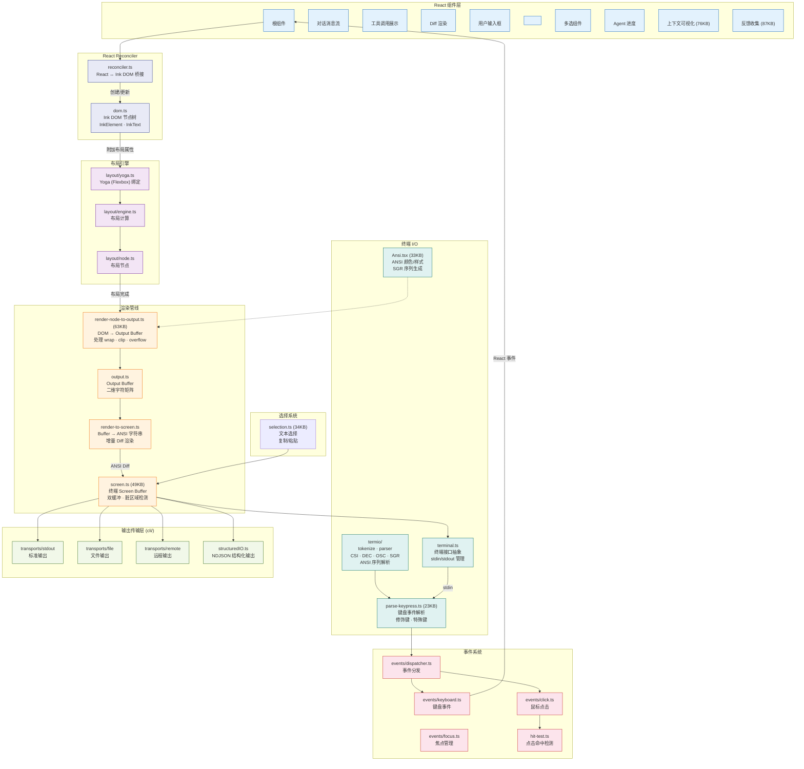

# 0.4 UI 渲染管线详图（Ink Rendering Pipeline）

> Claude Code 的终端界面不是简单的 `console.log`——它是一个完整的 React 应用，用自定义渲染器将 React 组件树渲染为 ANSI 终端输出。本节揭示这个令人惊叹的渲染管线。

## 先感受一下：普通 CLI vs Claude Code

```
普通 CLI（比如 git status）：
  输出一段文字，完事。不会变，不会动。

Claude Code 的终端界面：
  ├── AI 的回复在实时一个字一个字地蹦出来（流式输出）
  ├── 同时下面显示"正在读取文件..."的进度条在转
  ├── 突然弹出一个权限确认框"要执行 rm 命令吗？[y/n]"
  ├── 侧边还有 Agent 任务的状态在实时更新
  ├── 用户可以滚动查看历史对话
  └── 支持 Vim 快捷键编辑输入
```

这已经不是"打印文字"了，这是一个**动态交互界面**。用 `console.log` 写这些会疯掉——所以 Claude Code 用了跟**网页**一样的思路来渲染终端。

## 为什么用 React 渲染终端？

| 网页 | Claude Code 终端 | 干的事一样 |
|------|-----------------|-----------|
| `<div>` | `<Box>` | 容器，控制布局 |
| `<span>` | `<Text>` | 显示文字 |
| CSS Flexbox | Yoga（同一个引擎） | 计算每个元素放在哪里 |
| 浏览器渲染像素 | 输出 ANSI 转义序列 | 把内容画到屏幕上 |
| DOM diff（只更新变化的部分） | 双缓冲 diff（只输出变化的字符） | 避免全量重绘闪烁 |

React 的声明式模型让团队可以**描述 UI 应该是什么样**，而不是**手动管理每一帧怎么更新**。

## Claude Code 为什么看起来这么流畅？

流畅感来自**三层优化叠加**，不只是 API 的流式返回：

### 第一层：API 流式返回（Stream）

```
没有 Stream：
  等 3 秒... 等 3 秒... 等 3 秒... 突然一整段文字全部出现

有 Stream：
  我 → 来 → 看 → 看 → 这 → 个 → 文 → 件
  一个字一个字蹦出来，像在打字
```

Claude API 本身支持流式返回——一个 token 生成一个就发一个。这是最基础的流畅感来源。

### 第二层：只更新变化的部分（Diff 渲染）

如果每收到一个字就**清屏重画整个界面**：

```
收到"我"  → 清屏，重画 50 行 → 闪一下
收到"来"  → 清屏，重画 50 行 → 闪一下
收到"看"  → 清屏，重画 50 行 → 闪一下
每秒闪 20 次，眼睛要瞎了 💥
```

Claude Code 的做法——双缓冲 Diff：

```
收到"我"  → 跟上一帧对比，只有 1 个字变了 → 只输出 1 个字
收到"来"  → 跟上一帧对比，只有 1 个字变了 → 只输出 1 个字
收到"看"  → 跟上一帧对比，只有 1 个字变了 → 只输出 1 个字
完全不闪，丝滑 ✅
```

### 第三层：硬件滚动（DECSTBM）

滚动历史对话时，如果用软件重绘：

```
向上滚 3 行 → 重新绘制可见区域全部 50 行 → 发送 2000+ 个字符 → 慢
```

用硬件滚动：

```
向上滚 3 行 → 告诉终端"你自己滚" → 发送 2 个指令 → 瞬间完成
```

### 三层叠加 = 原生应用般的流畅

```
Stream      → 内容实时到达，不用等
Diff 渲染   → 只画变化的部分，不闪烁
硬件滚动    → 滚动时终端自己处理，不重绘

三层一起   → 看起来像一个原生应用，不像 CLI
```

## 渲染管线概览

渲染过程分为 5 个阶段：

```
React 组件 → Reconciler → DOM 树 → Yoga 布局 → Output Buffer → ANSI 输出
```

1. **React 组件** — 开发者用 JSX 编写 UI 组件（如 `<MessageList/>`、`<Dialog/>`）
2. **Reconciler** — 自定义的 React Reconciler 将组件树转换为 Ink DOM 节点
3. **Yoga 布局** — 使用 Facebook 的 Yoga 引擎计算 Flexbox 布局（和 React Native 同款）
4. **Output Buffer** — 将布局结果渲染为二维字符矩阵
5. **ANSI 输出** — 通过增量 Diff 渲染，只更新终端上变化的部分

### 用一个具体例子走一遍

当 Claude 说"我来读取这个文件"并调用 FileRead 时：

```
第 1 步：React 组件更新
  <MessageList>
    <Message text="我来读取这个文件" />
    <ToolUseLoader tool="FileRead" status="执行中..." />   ← 新增
  </MessageList>

第 2 步：Ink DOM 更新
  ink-root
    └── ink-box (MessageList)
          ├── ink-text "我来读取这个文件"
          └── ink-box (ToolUseLoader)              ← 新增节点
                └── ink-text "⏳ 正在读取文件..."

第 3 步：Yoga 布局计算
  "我来读取这个文件"     → 第 1 行，x=0, y=0, 宽度=80
  "⏳ 正在读取文件..."   → 第 2 行，x=0, y=1, 宽度=80   ← 新算出来的位置

第 4 步：画到字符矩阵
  第 0 行: [我][来][读][取][这][个][文][件][ ][ ]...
  第 1 行: [⏳][ ][正][在][读][取][文][件][.][.][.]...   ← 新增这一行

第 5 步：跟上一帧对比，只输出变化的部分
  上一帧只有 1 行，这一帧有 2 行
  → 只需要输出第 2 行
  → 发送：ESC[2;1H⏳ 正在读取文件...    （移动光标到第2行第1列，写入内容）
```

这就是"渲染管线"——数据从 React 组件开始，经过一层层处理，最终变成终端上你看到的文字。

## 渲染管线架构图



## 关键技术细节

### 双缓冲与增量渲染

`screen.ts` 实现了**双缓冲**机制：维护两个 Buffer（当前帧和上一帧），每次渲染时只计算差异部分，生成最少的 ANSI 转义序列发送到终端。这大幅减少了终端闪烁和 I/O 开销。

### 事件系统的双向流动

渲染管线是**单向**的（组件 → 终端），但事件系统是**反向**的（终端 → 组件）：

1. 终端接收到 stdin 数据
2. `parse-keypress.ts` 解析为结构化的键盘事件
3. 事件分发器将事件路由到正确的组件
4. React 组件处理事件，触发状态更新
5. 状态更新触发重新渲染（回到渲染管线）

### 多输出传输层

终端输出不一定只发往 `stdout`。Claude Code 支持多种输出传输：
- **stdout** — 标准终端输出
- **file** — 输出到文件（用于日志和调试）
- **remote** — 通过 WebSocket 发送到远程客户端
- **NDJSON** — 结构化 JSON 输出（用于程序集成）

> **下一节**：[0.5 服务层与扩展机制](./05-services-and-extensions.md) — 了解 API 调用、MCP、Skills 等服务如何运作。
